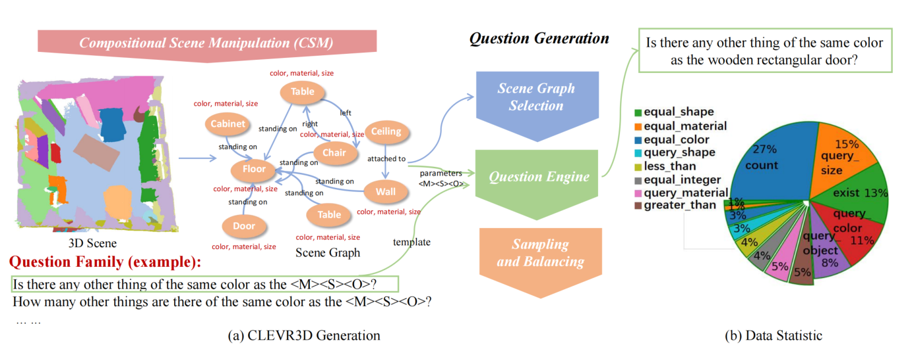

# CLEVR3D

**Xu Yan***, **Zhihao Yuan***, Yuhao Du, Yinghong Liao, Yao Guo, Zhen Li, and Shuguang Cui, 
"*Comprehensive Visual Question Answering on Point Clouds through Compositional Scene Manipulation
*" [[arxiv]](https://arxiv.org/pdf/2112.11691.pdf).

 
 
 
If you find our work useful in your research, please consider citing:
```latex
@article{yan2021clevr3d,
  title={Comprehensive Visual Question Answering on Point Clouds through Compositional Scene Manipulation},
  author={Yan, Xu and Yuan, Zhihao and Du, Yuhao and Liao, Yinghong and Guo, Yao and Li, Zhen and Cui, Shuguang},
  journal={arXiv preprint arXiv:2112.11691},
  year={2021}
}
```


## Installation

### Requirements
- pytorch >= 1.8 
- yaml
- easydict
- pyquaternion
- [lightning](https://github.com/Lightning-AI/lightning) (tested with pytorch_lightning==1.3.8 and torchmetrics==0.5)

## Data Preparation
The VQA3D data can be found in `data/CLEVR3D/CLEVR3D-REAL.json`. The data has the following structure:
```
{
"question":[
{
    "scan": "f62fd5fd-9a3f-2f44-883a-1e5cf819608e",
    "image_index": 0,
    "question": "Are there the same number of sofas and wide sinks?",
    "answer": "no",
    "template_filename": "compare_integer.json",
    "question_family_index": 0,
    "question_type": "equal_integer"
},
...
]}
```
The scan number is the same as [3RScan](https://github.com/WaldJohannaU/3RScan).
Please download the preprocessed 3RScan data from [Baidu Netdisk](https://pan.baidu.com/s/1q-K79cEeHzUaBJ1ZjkNxvw) (**ifei**). And modify the data path in `lib/config.py`.

## Training
```shell
cd <root dir of this repo>
python main.py --log_dir {LOGNAME} --preloading --gpu 0 
```


## Evaluation
```shell
python main.py --test --checkpoint <dir for the pytorch checkpoint> --gpu 0
```
